# **Gambling Problem**

### DeathSignal Productions

## _Game Design Document_

---
Developed by: Nicolas Amaya and Pablo Paz \
&copy; 2026\
\
This is a project for the course of _Software Construction and Decision-Making_ available in GitHub base in the MIT License. 

##

## _Index_

---

* [**Gambling Problem**](#gambling-problem)
    * [DeathSignal Productions](#deathsignal-productions)
  * [_Game Design Document_](#_game-design-document_)

  * [_Index_](#_index_)
  * [_Game Design_](#_game-design_)
    * [**Summary**](#summary)
      * [Description](#description)
    * [**Atmosphere**](#atmosphere)
      * [References](#references)
    * [**Gameplay**](#gameplay)
  * [_Technical_](#_technical_)
    * [Glossary](#glossary)
    * [**Screens**](#screens)
      * [Title Screen](#title-screen)
      * [Pause](#pause)
      * [Analytics](#analytics)
      * [Account](#account)
      * [Main Game](#main-game)
      * [Terminal](#terminal)
      * [DMs](#dms)
      * [Bank](#bank)
      * [Hard Reset](#hard-reset)
      * [Soft Reset](#soft-reset)
    * [Game concepts and character](#game-concepts-and-character)
    * [Casino website](#casino-website)
    * [Terminal](#terminal-1)
    * [Main character](#main-character)
    * [Computer screen](#computer-screen)
    * [Backend Analytics](#backend-analytics)
    * [Event Driven Architecture](#event-driven-architecture-)
      * [Provisional events:](#provisional-events-)
    * [**Controls**](#controls)
    * [**Mechanics**](#mechanics)
  * [_Level Design_](#_level-design_)
    * [**Themes**](#themes)
    * [**Game Flow**](#game-flow)
      * [Tutorial](#tutorial)
      * [Game Loop](#game-loop)
  * [_Development_](#_development_)
    * [Cache](#cache)
    * [Init](#init-)
    * [Game Instance](#game-instance)
    * [Exploit](#exploit-)
    * [ExploitsEventManager](#exploitseventmanager)
    * [Player](#player)
      * [Inventory](#inventory-)
      * [Bank](#bank-)
      * [Mafia](#mafia-)
      * [Casino](#casino-)
    * [EventManager](#eventmanager-)
    * [Sessions](#sessions)
    * [DB Manager](#db-manager-)
    * [Cache](#cache-)
  * [_Graphics_](#_graphics_)
    * [**Style Attributes**](#style-attributes)
    * [**Graphics Needed**](#graphics-needed)
  * [_Sounds/Music_](#_soundsmusic_)
    * [**Style Attributes**](#style-attributes-1)
    * [**Sounds Needed**](#sounds-needed)
    * [**Music Needed**](#music-needed)
  * [_Schedule_](#_schedule_)

## _Game Design_

---

### **Summary**

A high-stakes poker roguelike where your money is your life. Build a deck of illegal exploits that let you manipulate cards, cheat the table, and outplay both the casino and the mafia. Take risky missions, break the rules, and push your luck but , try not to get banned, but if you lose it all, you don’t just go broke, you die.

We are trying to make this an immersive experience. We achieve this being a meta game. You are the main character that it's playing online poker. The consequence of your desitions fell real to you. The game will be displayed as a typical desktop screen in where you can receive emails, DMs. You use a TUI in your terminal and use your browser to play. 

#### Description

For some reason you get the contact of some guys that are infiltrated in an online casino. They way they operate is that they lend you money and give you access to P&oslash;KER_FACE. This TUI gives you many exploits (that are not cheap) that increase your chances of becoming a millionaire. 

As you play you need to keep your loans in check because this mafia guys are not messing around, and they will kill you. They also can give you access to higher bitting tables, but the only problem is that when you change tables you leave behind the exploits you already bought. Other way to earn more money is that they offer you to back your bet 2x, 3x, 4x, depending, but remember that in that same proportions you can lose.

You can't be too greedy and careless of how you cheat because the casino will ban your account. If it sees your account suspicious will make you lose your exploits and money that is in your casino account at the moment.

The idea is that you balance your cheats and money to be the richest before making the mafia boss want to kill you. Making the game in a way a psychological horror with a tense environment, challenging your poker skills and desition making.    

### **Atmosphere**

You are in a very dangerous situation. You must feel kind of stress that all the money can disappear in an instance. You need to stay alert for noises in your house and call the police if necessary making you don't be at ease bluing the line between if they are at your real hose or in the game. 

Experience the rush of energy and dopamine on every win. As your money keeps increasing curiosity of how much more you can make? what more are you going to get away with?   

#### References

**Balatro** 
> The poker roguelike. Balatro is a hypnotically satisfying deckbuilder where you play illegal poker hands, discover game-changing jokers, and trigger adrenaline-pumping, outrageous combos.
> [(Steam, 2026)](https://store.steampowered.com/app/2379780/Balatro/)

_Balatro_ is one of our biggest inspirations. Tested that the formula of a poker roguelike is possible and fun. The casino will be base in the design of this game. 
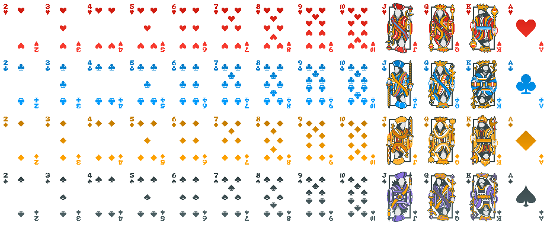

**Welcome to the Game**

> "Welcome to the Game is a creepy horror/puzzle game that takes you into the world of the Deep Web. Explore the Deep Web with the sole purpose of trying to find a Red Room, an online service / website that allows you to see and participate in interactive torture and murder" 
> [(Steam,2026)](https://store.steampowered.com/app/485380/Welcome_to_the_Game/).

This is an inspiration for a game base in hackers. The formula for the atmosphere is from this game, how it makes an immersive scary run. You also work for hackers but be careful they are dangerous people. 

**KinitoPET**

> "KinitoPET is a psychological horror experience that takes place through Kinito, an early 2000s virtual assistant. Kinito is able to walk, talk, browse, adapt, and play games as Kinito is like no other with its adaptive technology!"
> [(Steam,2026)](https://store.steampowered.com/app/2075070/KinitoPET/)

This game is widows UI type game, we would like something like this for ours. 

**Unfriended Dark Web** 

> The movie follows a group of friends who find a laptop that has access to the dark web, only to realize they are being watched by the original owners, a group of cybercriminal hackers.
> [(Wikipedia, 2026)](https://en.wikipedia.org/wiki/Unfriended:_Dark_Web) \

[**Trailer**](https://youtu.be/XenTM_C9fxM?si=j-4xl5aWnMIcub2C)
\

These movies is an inspiration of how to build a scary experience with meta elements.   

### **Gameplay**

As previously mentioned the main objective is to make the most amount of money without dying while also being careful in how you use exploits. In practice, you have a limited number of turns that can be increased if you play your cards right. The way you play is like handling a casino website where you can play texas held'em poker. You basically click buttons if you want to stay, fold, raise, etc. After your decision the game continues. On your turn, you can also click the exploits you have at the risk of getting your account banned and losing your chips.

Leveling is the act of changing tables that resets the exploits you have but increase the money you win in each turn. And the exploits available changes base in the table. You also need to make synergies for example if you are using the exploit to change the card, you should check the history of cards played so you don't change it to one already played thus being caught.  Or if you are counting cards is a good idea that when is high you can see the next flush of cards. 

Every game must feel unique and there is no one strategies is up to you how you manage your resources.

The indicators that you are making mad the mafia boss is that some exploits can start to fail, strange things happening in your game... and then you start hearing things at home until suddenly they get to you and shut you. That is how you can lose. 

For the casino it should be difficult to know if you are being caught thus the tension building tension on every turn you play and before using exploits. 

For the TCG aspect, the exploits will work as these cards. Better exploits are harder to find and have less probability of appearing when winning in a table. Some exploits can have a small chance of disappearing of your exploit deck after being used (usually specified in the exploit description). Each exploit card will have some art representing what the exploit does.

The game is a roguelike experience, this meaning that losing doesn't restart your progress. In this game you have a casino account that can be banned, which means you lose the money/chips that were in the account, you don't lose the money outside the banned account. Then there is the "real" death of the run part, where the mafia gets mad at you, they get to your house and end you, which means you lose it all your progress. Being how far in the tables you've gone and all of your money. But the tun loss is not for nothing as the discovery of powerful exploits is not lost at all. The more you play the game the more exploits you find. The first time you play you have basic exploits like lets say change card and disconnect player, and as you advance you discover change suit. Now there is a chance that when restarting the game when killed by the mafia, you may start with change suit instead of disconnect.

#### Texas Hold'em 
This version is play by drawing 2 cards to each player then every player has a turn to place a bet. Then tree cards are turn (that's call the floop). After there is a second round of turn in witch players can raise, pay or fold: 
    if player raises the bet then other players have a turn again and this loop can be infinite. If the player fold it automatically loses the change to take the current pool of money. Wen the player pays it consider still in the game. 
The cycle will be done for the turn (4 cards in the table) and the river (5 cards in the table). When all the turn are play and bets the players show their cards and see who has the highest conviction and that players takes all the cash pool. 
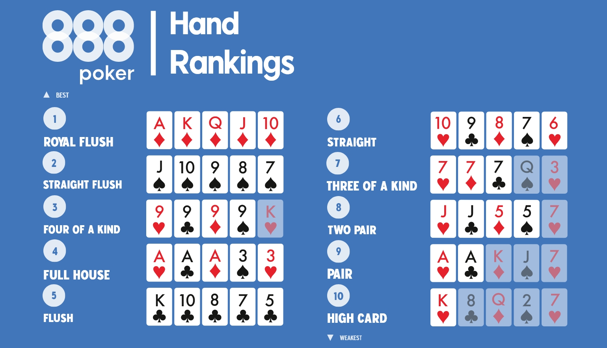

full rule book: [rules](https://bicyclecards.com/how-to-play/texas-holdem-poker) \
video version: [video](https://youtu.be/ep1riICX-KU?si=4E8vLbSnqE0Q2WxZ)

## _Technical_

---
### Glossary
Hand: current player cards

Round: the amount rounds to the complete game loop. It goes up one when a player is in the screens that ask if you want to continue.

Turn: every time the player is prompted to place a bet. 

Run: defined as the moment the game instance is terminated. 

Back bet: common practice in the gambling world in witch people outside the casino offer you to multiply in some amount your returns. For example, you place a bet for 10k and be offer 3x they will pay you 20k extras if you win. But you could also lose 30k.  

Flop: initial face up of tree cards 

Turn: is the moment there are 4 cards turn in the table 

River: the last card is turn 

Fold: the act of not paying the current bet and losing the money placed 
### **Screens**

1. [Title Screen](#title-screen)
2. [Pause Screen](#pause)
3. [Analytics](#analytics)
4. [Account](#account)
5. Game
    1. [Main Game](#main-game)
    2. [Terminal](#terminal)
    3. [DMs](#dms)
    4. [Bank](#bank)
6. Lose Screens
   1. [Hard Reset](#hard-reset) 
   2. [Soft Reset](#soft-reset)

#### Title Screen
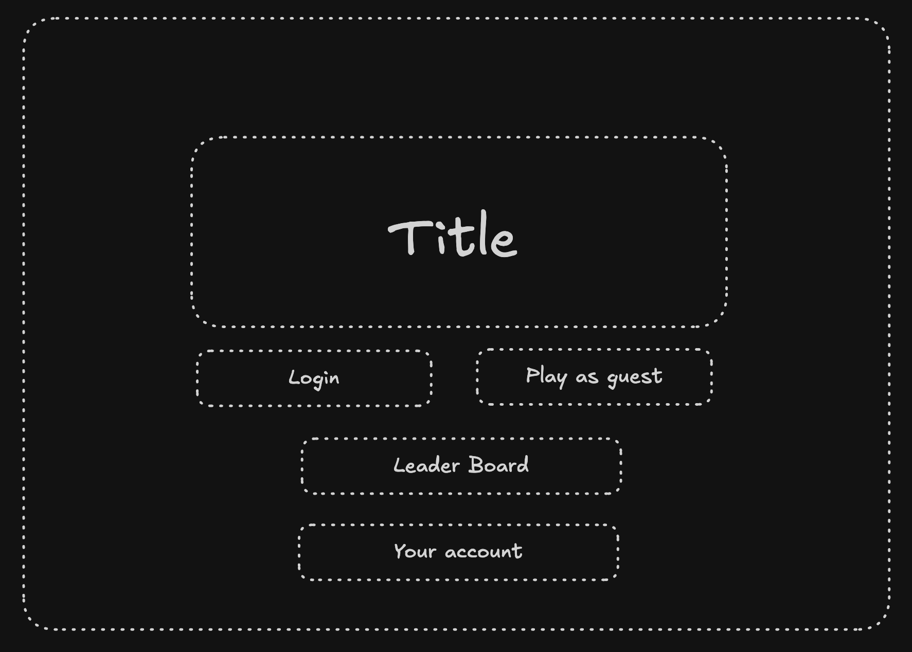
#### Pause
The pause page will be the content blur and a simple continue of leave button. 
#### Analytics
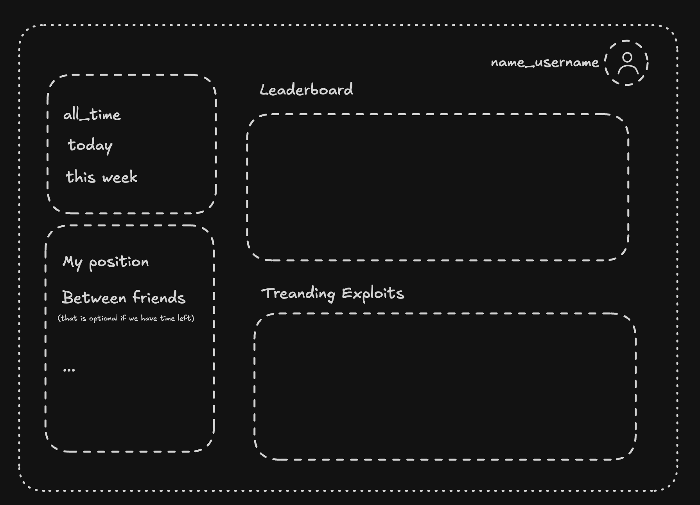
#### Account
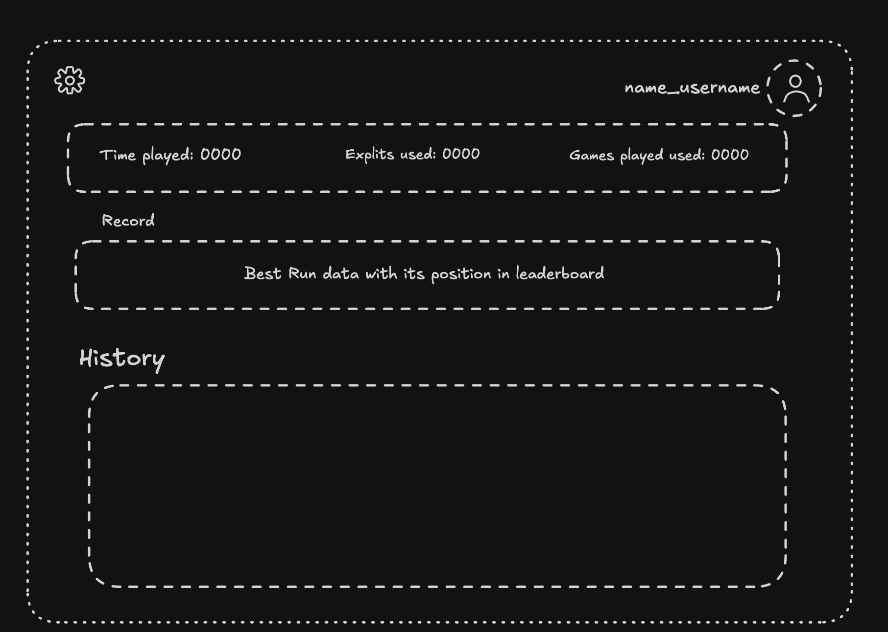
#### Main Game
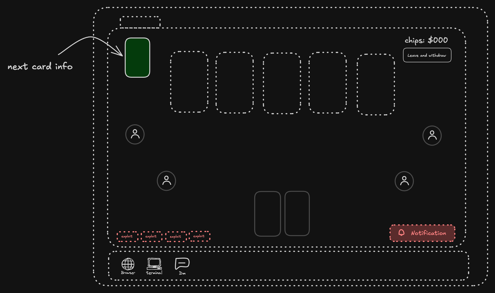
#### Terminal
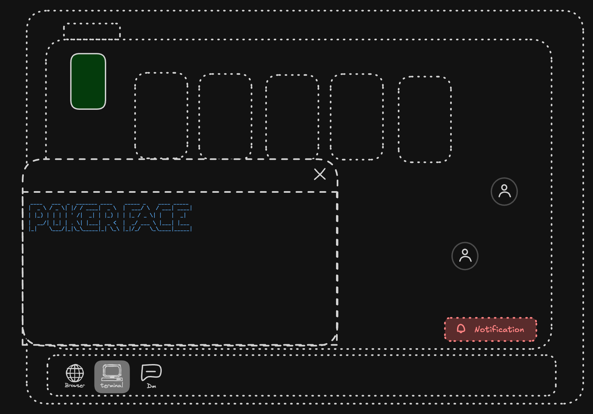
#### DMs
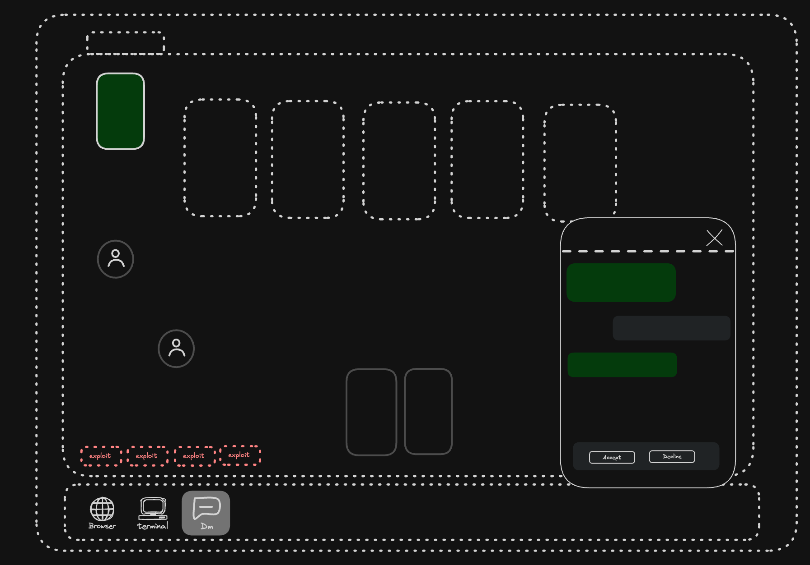
#### Bank
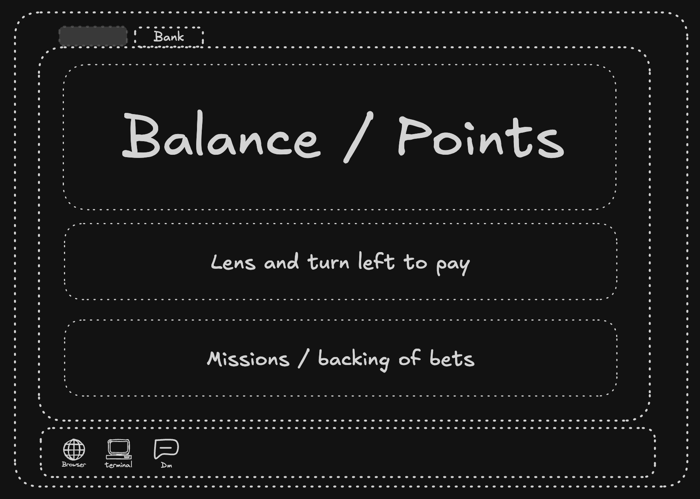
#### Hard Reset
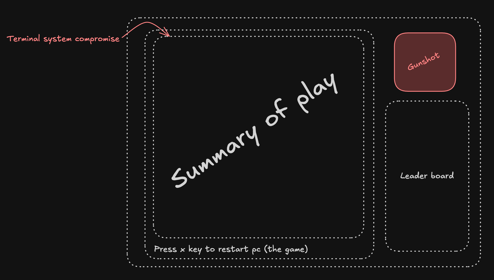
#### Soft Reset
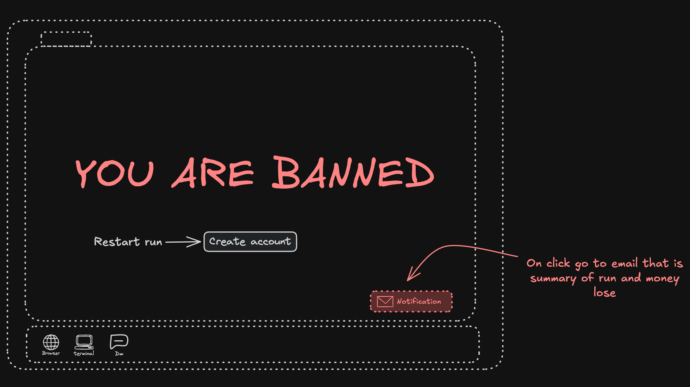
### Game concepts and character
### Casino website
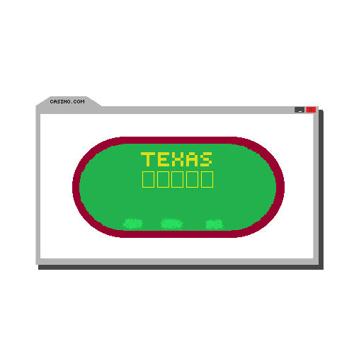
### Terminal
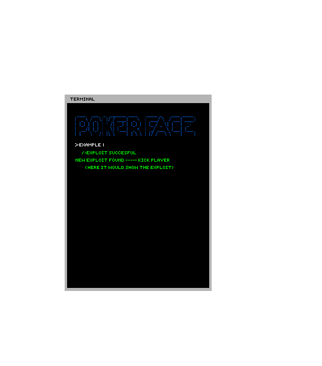
### Main character

### Computer screen
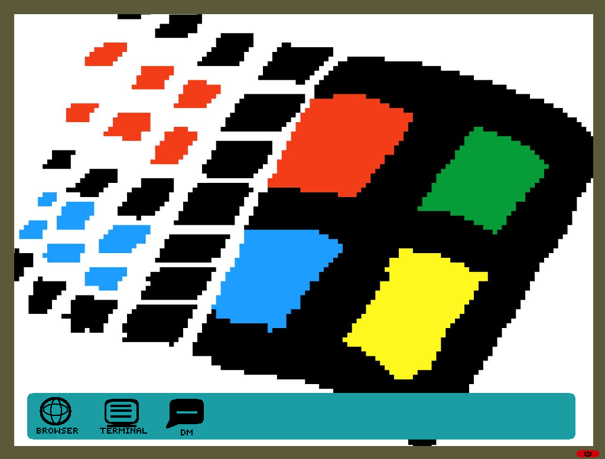

### Backend Analytics

For our game the most important aspect is the money earn at the end of the run. Also, how much time it took to do that. We time stamp the start of the run at the server level. The client send the end of run event to server. At that moment it takes the stamp and subtract to the previous one saved, we are aware that this fails to check for pauses or other edge cases, if needed a more robust implementation can be added. With the end of run event then the points are saved to the leader board table with the associated user if logged in, if not it will simply not save the run. This table must be ordered by points in an efficient way. 

The idea is to trigger event that a DB controller is hearing as middleware, for the other analytics, as exploits bought and exploits use. It also works to be the source of truth of the inventory of the player's run. This makes it temper proof. 

In conclusion, we will save:  
- Time of the run
- Exploits bought 
- Exploits used 
- Money win in total 
- Money spend 
- Total earnings

We could cache some of the users data for the analytics page: 
- His record of best run 
- His time played in general
- His game started
- His recent history (last 20 games in summary)

To see if leaderboard table must be reordered or updated for the page of the same name. "e cache the top 50 players to only check if the current run is better that those. The other time we check for leaderboard position if that run was a personal record. 

### Event Driven Architecture 

This is because we want a flexible system for constant change in its logic. Exploits are hearing all that is happening, also the bank and the database controller, and others. Exploits might change the deck or the player attributes. The bank object is the one that check if the exploit can be bought and applied the changes.

#### Provisional events: 
This can be extended if necessary. 

Game Event
- turn ended 
- hard reset 
- soft reset 
- withdraw chips
- player change 
- deck change
- time exceeded _(experimental)_
- buy exploit attempt 
- winner assigned 
- change of round
- prompt:continue 
- backed bet status change

Exploit Events 
- exploit trigger 
- exploit used
- exploit success bought
- exploit was kill

### **Controls**

Our game is base in click events the only need of a key press event (as this moment) is for the pause screen. 

### **Mechanics**

The key factor is that we are making the already fun game of poker and adding some twists. The idea is for players constantly try new strategies and different routes to progress. Also track their progress and contrast.  

The game starts as normal poker with 2 random exploits unlocked. The way to progress is by winning rounds a get to certain threshold in money. If you get to them, you can level to tables with higher bitting so you win much more pear turn and unlock new exploits. 

The limitation is that you change table and only can take one exploit with you. This as it add the need to buy the exploits again. The casino instance keeps track of how much exploits are used and the rounds played. If you trigger a soft reset you lose the chips and the exploits that you were using. The difference is that the money in the is safe so you could instantly buy them back and also use different kind of exploits in the beginning.  

But if the game was just to continue playing without purpose it would be boring. The other twist is the mafia; you need to keep in check your loans by withdrawing ang paying. It determines the amount of rounds you have to pay (might vary in some internal logic as current level). If the loans are not paid in time the game ends because they go to you house and kill you.   

The meta part is that you actually feel like you are doing the complex gambling. You could evaluate your current strategies, compare them with other players, see what exploits are useful, check if you are behind.  

## _Level Design_

In Gambling Problem the different poker tables function as the different levels. The starting table the Green Mat Table is the perfect place to learn how to play Texas Hold'em poker (if the player doesn't know how it works) and to get acquainted with the exploit cards they are dealt. 
### **Themes**

1. Table 1 (green mat)
    1. Mood
        1. Calm and inviting (introduction table to poker)
        2. Still tense to not lose all your money
    2. Objects
        1. _Ambient_
            1. Other players
            2. Chill house/electronic music
        2. _Interactive_
            1. Cards
            2. Exploits
            3. Buttons (raise, stay, fold, etc)
2. Table 2 (blue mat)
    1. Mood
        1. Dangerous, tense
        2. Players are not friendly
    2. Objects
        1. _Ambient_
            1. Other players feel more experienced
            2. A more active edm track
            3. Suits of armor
        2. _Interactive_
            1. Guards
            2. Giant rats
            3. Chests

_(example)_### **Game Flow**
#### Tutorial
1. Notification dm got 
2. Player is presented the main page 
3. Poker face use (how to see exploit description)
4. Display of money that must be paid
5. See the bank page (describe the main info of that page like who much money they have) 
6. First round

#### Game Loop

1. ¿Continue playing?
2. round + 1
3. flop and hand cards 
4. place bet (if turn)
5. { end turn event } 
6. change player { event trigger }  
7. repeat until all place bet / fold 
8. turn (use the Bet state machine)
9. river (use the Bet state machine)
10. determine winner 
11. give chips 
12. round end 
13. restart loop

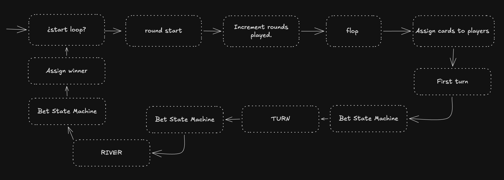
## _Development_

---
### Cache

- Sessions
  - Attributes of the run
- 50 best runs 
- ExploitsClassList
  - meta data (price, level cap, ...rest)

### Init 

Route _start_ game is reach: 
- new Game(timestamp)
- abstract addPlayer() _to game_
- send static assets
- add player id cookie
- addPlayer() _to session manager_

### Game Instance

We need to have game instances. Are created and associated to a player id. For the time being having only one, after we need to create this in a cache or _singleton_ parent of sessions. 

Is important to say that we need to implement a why to know if game instance must be terminated because is abandoned (no players in it, isPause for to long). So we save a refreshToken and a why to know if is pause. We add a session manager to see all of this. 

Elements: 
- Session: {isPaused: boolean, refreshToken:string} 
  - killSession()
- Deck:class
  - PokerMaster
- White list of exploits: string[]
- attachedExploits: Exploit[]
- currentLevel: number
- EventHandler:class(hardReset)
  - Must have EventHandlerClient
- Players:class
  - private players: Payer[] 
  - addPlayer(playerId)
  - attachPlayerHook(playerSession)
  - attachExploitsHook(exploitSession)
- abstract hardReset()

### Exploit 

Interface required for every exploit:
- init(eventos?)
- kill()
- trigger()
- playerId: string

Note: might be necessary to have an abstract Deck factory for card manipulation without changing other things. 

Provisional exploits:

- No reshuffle \
Disables that the card are shuffle on every round change. 

- Count cards \
Like in blackjack. it is not useful without the no shuffle exploit. 

- Change current hand (to random) \
Player hand redraw. 

- See coming card \
Peak the current deck cards array

- See card played history \
Save and stack of all the cards played. 

- Save a card \
Draws card to change current create exploit to use the card that was picked by user

- Remove player \
Remove a player from the players array.  

- Disconnect player \
Mark player as disconnected. Overwrite the _change turn_ method to skip player in the current round only.

- Change to random strong (A, K, Q, J) \
Pick random card in that range then update the deck to that 

- Change to x card \
Put that card in players hand and trigger event to check if card was already played. 

- Change the coming card \
Change the deck card to x

- Change username \
Reset the casino awareness 

- Change suit \
Change the suit of the player card or the coming card

- See flop \
See the 3 card that will be placed at the beginning

- See a player's cards \
Pick a player and see their current hand

- Trigger full view \
See all the players cards all the time. 

### ExploitsEventManager
Facade that abstract the hook logic and session attachment to communicate the events in the server to client. In this  

### Player
Encapsulates the player info in current session. Might change in the future for multiplayer's sessions. 

Description: 
- playerId
- Inventory
- Bank:class
- Mafia:class
- Casino:class

#### Inventory 
This class is encapsulation of the storage, manage of exploits, and history of them. 

#### Bank 
This class is encapsulation of the logic of validation of exploit bough and addition to inventory. Also, money and chips storage of player.

#### Mafia 
This class encapsulates the logic of tracking loan payment. It tracks rounds played and money paid. If the back bet is activated makes the changes needed. It must trigger the hard reset logic. 

#### Casino 
Tracks exploits used and cooldown of account. Basically if the conditions are meets trigger the soft reset. As we develop we tune the criteria for this to happen.  

### EventManager 
This is the way to propagate event between children. Thinking of making a factory for creation and mitigation of the parameter drilling. We create and EventManagerClient class that encapsulates the communication of client and server.

### Sessions
We are going to abstract the creation and attachment of hook to game session. As the hook may disconnect in this way we use a facade to make event manager communicate the event to client. Wen connections are made or restore it wraps the EventClientManager to send the event through the hook. We need to have a _strategy_ base contract for this class so that we add the ExploitsHook and The PlayerHook.

This could be a service detached from the webserver, for independence in case of fault or potential restarts. 

### DB Manager 
Singleton with the db connection attach, with the method for saving what's needed in the sql db. 

### Cache 
The cache needs to be tune but must be the model controller for redis connection for thing as best 50 runs, best run of current players, games instances (in memory), etc.

## _Graphics_

---

### **Style Attributes**

What kinds of colors will you be using? Do you have a limited palette to work with? A post-processed HSV map/image? Consistency is key for immersion.

What kind of graphic style are you going for? Cartoony? Pixel-y? Cute? How, specifically? Solid, thick outlines with flat hues? Non-black outlines with limited tints/shades? Emphasize smooth curvatures over sharp angles? Describe a set of general rules depicting your style here.

Well-designed feedback, both good (e.g. leveling up) and bad (e.g. being hit), are great for teaching the player how to play through trial and error, instead of scripting a lengthy tutorial. What kind of visual feedback are you going to use to let the player know they&#39;re interacting with something? That they \*can\* interact with something?

### **Graphics Needed**

1. Characters
    1. Human-like
        1. Goblin (idle, walking, throwing)
        2. Guard (idle, walking, stabbing)
        3. Prisoner (walking, running)
    2. Other
        1. Wolf (idle, walking, running)
        2. Giant Rat (idle, scurrying)
2. Blocks
    1. Dirt
    2. Dirt/Grass
    3. Stone Block
    4. Stone Bricks
    5. Tiled Floor
    6. Weathered Stone Block
    7. Weathered Stone Bricks
3. Ambient
    1. Tall Grass
    2. Rodent (idle, scurrying)
    3. Torch
    4. Armored Suit
    5. Chains (matching Weathered Stone Bricks)
    6. Blood stains (matching Weathered Stone Bricks)
4. Other
    1. Chest
    2. Door (matching Stone Bricks)
    3. Gate
    4. Button (matching Weathered Stone Bricks)

_(example)_

## _Sounds/Music_

---

### **Style Attributes**

Again, consistency is key. Define that consistency here. What kind of instruments do you want to use in your music? Any particular tempo, key? Influences, genre? Mood?

Stylistically, what kind of sound effects are you looking for? Do you want to exaggerate actions with lengthy, cartoony sounds (e.g. mario&#39;s jump), or use just enough to let the player know something happened (e.g. mega man&#39;s landing)? Going for realism? You can use the music style as a bit of a reference too.

 Remember, auditory feedback should stand out from the music and other sound effects so the player hears it well. Volume, panning, and frequency/pitch are all important aspects to consider in both music _and_ sounds - so plan accordingly!

### **Sounds Needed**

1. Effects
    1. Soft Footsteps (dirt floor)
    2. Sharper Footsteps (stone floor)
    3. Soft Landing (low vertical velocity)
    4. Hard Landing (high vertical velocity)
    5. Glass Breaking
    6. Chest Opening
    7. Door Opening
2. Feedback
    1. Relieved &quot;Ahhhh!&quot; (health)
    2. Shocked &quot;Ooomph!&quot; (attacked)
    3. Happy chime (extra life)
    4. Sad chime (died)

_(example)_

### **Music Needed**

1. Slow-paced, nerve-racking &quot;forest&quot; track
2. Exciting &quot;castle&quot; track
3. Creepy, slow &quot;dungeon&quot; track
4. Happy ending credits track
5. Rick Astley&#39;s hit #1 single &quot;Never Gonna Give You Up&quot;

_(example)_

## _Schedule_

---

_(define the main activities and the expected dates when they should be finished. This is only a reference, and can change as the project is developed)_

1. develop base classes
    1. base entity
        1. base player
        2. base enemy
        3. base block
2. base app state
      1. game world
      2. menu world
3. develop player and basic block classes
    1. physics / collisions
4. find some smooth controls/physics
5. develop other derived classes
    1. blocks
        1. moving
        2. falling
        3. breaking
        4. cloud
    2. enemies
        1. soldier
        2. rat
        3. etc.
6. design levels
    1. introduce motion/jumping
    2. introduce throwing
    3. mind the pacing, let the player play between lessons
7. design sounds
8. design music

_(example)_
