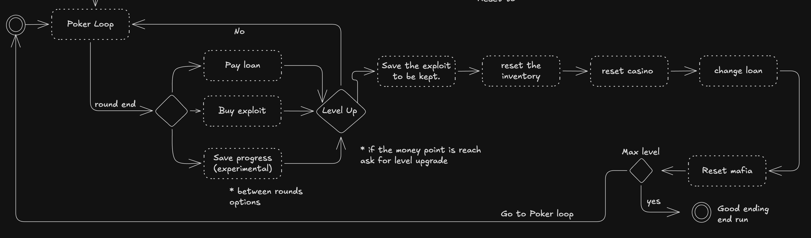

# **Gambling Problem**

### DeathSignal Productions

## _Game Design Document_

---

Developed by: Nicolas Amaya and Pablo Paz \
&copy; 2026\
\
This is a project for the course of _Software Construction and Decision-Making_ available in GitHub base in the MIT License.

##

## _Index_

---

- [**Gambling Problem**](#gambling-problem)
  - [DeathSignal Productions](#deathsignal-productions)
  - [_Game Design Document_](#_game-design-document_)

  - [_Index_](#_index_)
  - [_Game Design_](#_game-design_)
    - [**Summary**](#summary)
      - [Description](#description)
    - [**Atmosphere**](#atmosphere)
      - [References](#references)
    - [Glossary](#glossary)
    - [**Gameplay**](#gameplay)
      - [Texas Hold'em](#texas-holdem-)
  - [_Technical_](#_technical_)
    - [**Screens**](#screens)
      - [Title Screen](#title-screen)
      - [Pause](#pause)
      - [Analytics](#analytics)
      - [Account](#account)
      - [Main Game](#main-game)
      - [Terminal](#terminal)
      - [DMs](#dms)
      - [Bank](#bank)
      - [Hard Reset](#hard-reset)
      - [Soft Reset](#soft-reset)
    - [Game concepts and character](#game-concepts-and-character)
    - [Casino website](#casino-website)
    - [Terminal](#terminal-1)
    - [Main character](#main-character)
    - [Computer screen](#computer-screen)
      - [Provisional events:](#provisional-events-)
    - [**Controls**](#controls)
    - [**Mechanics**](#mechanics)
      - [Provisional Thresholds](#provisional-thresholds)
    - [Exploit](#exploit)
  - [_Level Design_](#_level-design_)
    - [**Themes**](#themes)
    - [**Game Flow**](#game-flow)
      - [Tutorial](#tutorial)
      - [Game Loop](#game-loop)
      - [Main Loop](#main-loop-)
        - [Poker loop](#poker-loop)
  - [Development\_](_development_)
    - [Event Driven Architecture](#event-driven-architecture)
    - [Init](#init-)
    - [Game Instance](#game-instance)
    - [ExploitsEventManager](#exploitseventmanager)
    - [Player](#player)
      - [Inventory](#inventory-)
      - [Bank](#bank-)
      - [Mafia](#mafia-)
      - [Casino](#casino-)
    - [EventManager](#eventmanager-)
    - [Sessions](#sessions)
    - [DB Manager](#db-manager-)
    - [Cache](#cache-)
    - [Backend Analytics](#backend-analytics)
  - [_Graphics_](#_graphics_)
    - [**Style Attributes**](#style-attributes)
    - [**Graphics Needed**](#graphics-needed)
  - [_Sounds/Music_](#_soundsmusic_)
    - [**Style Attributes**](#style-attributes-1)
    - [**Sounds Needed**](#sounds-needed)
    - [**Music Needed**](#music-needed)
  - [_Schedule_](#_schedule_)
  - [Provisional Stack](#provisional-stack-)

## _Game Design_

---

### **Summary**

A high-stakes poker roguelike where your money is your life. Build a deck of illegal exploits that let you manipulate cards, cheat the table, and outplay both the casino and the mafia. Take risky missions, break the rules, and push your luck but , try not to get banned. If you lose it all, you don’t just go broke, you die.

We are are making an immersive experience. We achieve this being a meta game. You are the main character that it's playing online poker. The consequence of your desitions fell real to you. The game will be displayed as a typical desktop screen in where you can receive emails, DMs. You use a TUI (terminal user interface) and use your browser to play.

#### Description

For some reason, you get the contact of some guys who are infiltrated in an online casino. The way they operate is that they lend you money and give you access to PøKER_FACE. This TUI (Terminal User Interface) gives you many exploits (that are not cheap) that increase your chances of becoming a millionaire.

As you play you need to keep your loans in check because this mafia guys are not messing around, and they will end you. They also can give you access to higher betting tables, but the only problem is that when you change tables your loans increase.

The idea is that you balance your cheats and maximize your earnings to be the richest before the mafia boss come for you. Making the game, in a way, a psychological horror, with a tense environment. Challenges your poker skills and desition making.

### **Atmosphere**

You are in a very dangerous situation. You feel stress that all the money can disappear in an instance. You need to stay alert. Blurring the line between of what is the game and your real house.

Experience the rush of energy and dopamine on every win. As your money keeps increasing. How much more money can make? What more are you able to get away with?

#### References

**Balatro**

> The poker roguelike. Balatro is a hypnotically satisfying deckbuilder where you play illegal poker hands, discover game-changing jokers, and trigger adrenaline-pumping, outrageous combos.
> [(Steam, 2026)](https://store.steampowered.com/app/2379780/Balatro/)

_Balatro_ is one of our biggest inspirations. Tested that the formula of a poker roguelike is possible and fun. The casino will be base in the design of this game.

**Welcome to the Game**

> "Welcome to the Game is a creepy horror/puzzle game that takes you into the world of the Deep Web. Explore the Deep Web with the sole purpose of trying to find a Red Room, an online service / website that allows you to see and participate in interactive torture and murder"
> [(Steam,2026)](https://store.steampowered.com/app/485380/Welcome_to_the_Game/).

This is an inspiration for a game base in hackers. The formula for the atmosphere is from this game, how it makes an immersive scary run. You also work for hackers but be careful they are dangerous people.

**KinitoPET**

> "KinitoPET is a psychological horror experience that takes place through Kinito, an early 2000s virtual assistant. Kinito is able to walk, talk, browse, adapt, and play games as Kinito is like no other with its adaptive technology!"
> [(Steam,2026)](https://store.steampowered.com/app/2075070/KinitoPET/)

This game is widows UI type game, we would like something like this for ours.

**Unfriended Dark Web**

> The movie follows a group of friends who find a laptop that has access to the dark web, only to realize they are being watched by the original owners, a group of cybercriminal hackers.
> [(Wikipedia, 2026)](https://en.wikipedia.org/wiki/Unfriended:_Dark_Web) \

[**Trailer**](https://youtu.be/XenTM_C9fxM?si=j-4xl5aWnMIcub2C)
\

These movies is an inspiration of how to build a scary experience with meta elements.

### Glossary

Hand: current player cards

Round: the amount rounds to the complete game loop. It goes up one when a player is in the screens that ask if you want to continue.

Turn: every time the player is prompted to place a bet.

Run: defined as the moment the game instance is terminated.

Back bet: common practice in the gambling world in witch people outside the casino offer you to multiply, in some amount, your returns. For example, you place a bet for 10k and be offer 3x they will pay you 20k extras if you win. But you could also lose 30k instead of 10k.

Flop: initial face up of tree cards

Betting turn: Amount of times there can be a raise of the bet in a single turn (depends on the betting ruleset)

Turn: is the moment there are 4 cards turn in the table

River: the last card is turn

Fold: the act of not paying the current bet and losing the money placed

Blind: the minimal bet to play. Is pay before you can see your cards

### **Gameplay**

As previously mentioned the main objective is to make the most amount of money without dying, climbing the different tables, while also being careful in how you use exploits. In practice, you have a limited number of turns that can be increased if you play your cards right. The way you play is on a casino website where you can play Texas hold'em poker.

Leveling is the act of changing tables, the players in higer tables have more money increassing the possibility to win more each round. And also, the exploits available changes based in the table and rank, meaning the higher you get, the more powerful exploits you get to "keep unlocked". After you unlock a new exploit in later runs you can buy them in lower tables. There are synergies between exploits, for example if you are using the exploit to change the card, you should check the cards that are coming so you don't change it to one that is already in play.

Every game must feel unique and there is no one strategy, is up to you how you manage your resources.

For the TCG aspect, the exploits will work as _"cards."_ Better exploits are harder to find and appear in higher betting tables. Each exploit card will have some icon representing what the exploit does.

The game is a roguelike experience, this meaning that losing doesn't restart your progress. There is the "real" death of the run, where the mafia gets mad at you, they get to your house and finish you. Which means you lose it all your progress. Being how far in the tables you've gone and all of your money.

But the loss is not for nothing as the discovery of powerful exploits is not lost at all. The more you play the game the more exploits you find. The first time you play you have basic exploits like lets say change card and disconnect player, and as you advance you discover change suit. Now there is a chance that when restarting the game when killed by the mafia, you may start with change suit instead of disconnect.

#### Texas Hold'em

This version is play by drawing 2 cards to each player then every player has a turn to place a bet. Betting follows a structured sequence where one player can place the first bet, and the others must respond by either paying (matching the current bet), raising (increasing the bet), or folding (leaving the hand). A key rule is that any raise must be at least as large as the previous increase; for example, if a player bets $10 and another raises to $30 (a $20 increase), the next player must raise by at least $20 or more.

Then tree cards are turn (that's call the floop). After, there is a second round of turn in witch players can raise, pay or fold.

The cycle will be done for the _turn_ (4 cards in the table) and the _river_ (5 cards in the table). When all the turn are play and bets made the player who has the highest conviction between the table and their cards show their cards and takes all the cash pool.

In no-limit games, players can raise up to all of their chips (all-in), and there is no limit to the number of raises as long as players have chips. A betting round ends when all remaining players have either matched the highest bet or folded, and all bets are collected into the pot, which is awarded to the winner.

In limit poker, however, there is a fixed number of raises per round, typically capped at four (bet, raise, re-raise, and final raise). Additionally, the bet size is fixed: in the first two rounds (preflop and flop), players use a smaller bet size, and in the last two rounds (turn and river), the bet size doubles. For example, if the small bet is $2, then in the later rounds the minimum raise would be $4.

full rule book: [rules](https://bicyclecards.com/how-to-play/texas-holdem-poker) \
video version: [video](https://youtu.be/ep1riICX-KU?si=4E8vLbSnqE0Q2WxZ)

## _Technical_

---

### **Screens**

\*Note: Early versions of the screens used as concepts

1. [Title Screen](#title-screen)
2. [Pause Screen](#pause)
3. [Analytics](#analytics)
4. [Account](#account)
5. Game
   1. [Main Game](#main-game)
   2. [Terminal](#terminal)
   3. [DMs](#dms)
   4. [Bank](#bank)
6. Lose Screens
   1. [Hard Reset](#hard-reset)
   2. [Soft Reset](#soft-reset)

#### Title Screen

#### Pause

The pause page will be the content blur and a simple continue of leave button.

#### Analytics

#### Account

#### Main Game

#### Terminal

#### DMs

#### Bank

#### Hard Reset

#### Soft Reset

### Game concepts and character

\*Note: Early concept art that couldn't be developed further due to time constraints

### Casino website

### Terminal

### Main character

### Computer screen

#### Provisional events:

This can be extended if necessary.

Game Event

- `round:start` → `Player[]`
- `round:start_turn` → `Player[]`
- `turn:start`
- `turn:end` → `{ moneyPot: number }`
- `round:end` → `{ round: number }`
- `game:state_change` → `Card[]`
- `deck:cards_deal`
- `deck:shuffle`
- `deck:flop` → `Card[]`
- `deck:turn` → `Card[]`
- `deck:river` → `Card[]`
- `deck:update_player_hand` → `PlayerHand`
- `player:validbet` → `ValidBet`
- `player:turn` → `Player["playerId"]`
- `player:input` → `UserInput`
- `player:insuficientfunds` → `{ min: number; player: Player }`
- `player:timeexeded` → `{ player: Player }`
- `player:invalid_input` → `{ error: string; player: Player }`
- `player:withdraw` → `{ chips: number; player: Player }`
- `player:deposit` → `{ chips: number; player: Player }`
- `player:placedbet` → `{ chips: number; player: Player["playerId"] }`
- `player:rename` → `{ prevPlayer: PlayerData; newPlayer: PlayerData }`
- `round:winners` → `GameWinnerPayload`
- `mafia:pay` → `{ money: number; player: Player["playerId"] }`
- `mafia:backbet_activation` → `{ player: Player["playerId"]; payload: NonNullable<BackBettting> }`
- `mafia:backbet_end` → `{ player: Player["playerId"] }`
- `mafia:backbet_update` → `Player`
- `reset:hard` → `{ end: TypeEnd; player: Player["playerId"] }`
- `reset:soft`
- `reset:quit`
- `levelup` → `{ level: number; playerId: Player["playerId"] }`
- `pause`
- `resume`
- `bot:reset` → `{ prevPlayer: PlayerData; newPlayer: PlayerData }`
- `end:game` → `{ playerId: Player["playerId"] }`

Exploit Events

- `exploit:buy` → `Omit<ExploitBuyPayload, "price">`
- `exploit:trigger` → `ExploitTriggerPayload`
- `exploit:wastrigger` → `ExploitTriggerPayload`
- `buy:error` → `{ playerId: Player["playerId"]; error: string; exploit: ExploitId }`
- `buy:success` → `{ playerId: Player["playerId"]; exploit: ExploitId; newBalance: number }`
- `exploit:invetory:add` → `{ playerId: Player["playerId"]; exploit: ExploitData }`
- `player:trigger` → `ExploitTriggerPayload`
- `trigger:error` → `{ playerId: Player["playerId"]; error: string; exploitId: ExploitId }`
- `exploit:event` → `{ from: ExploitId; playerId: Player["playerId"]; payload: unknown }`
- `exploit:kill` → `{ playerId: Player["playerId"]; exploitId: ExploitId }`
- `exploit:unlocked` → `{ playerId: Player["playerId"]; exploit: NextRank }`
- `rank:max` → `{ rank: number }`
- `levelup` → `{ playerId: Player["playerId"]; level: number }`

### **Controls**

Our game is based in click events. There will be buttons for the actions you can take in the poker game such as raising, folding and calling. The raise button will prompt the user to input the amount. Exploits will function by clicking on them and a play button will appear if it can be trigger.

### **Mechanics**

The key factor is that we are taking the already fun game of Texas Hold’em and adding some twists. The idea is for players to constantly try new strategies and explore different paths to progress. They can compare their results with other players and adjust their approach accordingly.

The game starts like a normal poker match, but with one random exploits unlocked. The objective is to win rounds and reach certain money thresholds. Once you reach them, you will move up to higher betting tables, where you can increase your earnings per turn and unlock new exploits.

A limitation is that when you change tables, the bots are better and have more money. This adds the need to buy the other exploits again. Having it challenges the player to always stay on their toes as victory can become difficult if the exploits and money are managed incorrectly.

If the game were just about continuing to play without purpose, it would become boring. That’s where the other twist comes in: the mafia. You need to manage your loans by withdrawing and repaying them. The interest rates are very high, making it a real challenge to overcome.

The mafia also determines how many rounds you have to repay the loan (this is all defined in the database base in the level change). If the loan is not paid on time, the game ends. What hppens next is that they [the mafia] come to your house and end you forever (or atleast until you restart another run).

The meta aspect is that it makes you feel like you are engaging in complex gambling. You can evaluate your current strategies, compare them with other players, see which exploits are useful, and check if you are falling behind. It feels very close to the real experience.

See the development section to see details in how the Mafia is modeled.

Monte Carlo in poker AI works by simulating many possible outcomes of a hand to estimate the chance of winning. The AI randomly completes the unknown cards (like opponents’ hands and future community cards) thousands of times, plays out each scenario, and counts how often it wins. From this, it calculates a win probability and uses it to decide whether to fold, call, or raise. This is adjustable, so creating different difficulties for each respective table is adjustable through this.

---

#### Provisional Thresholds

Intermediate levels exist for unlocking exploits. The price in here is to determine how much it will cost to go through the level. When finishing a level you can change tables to confront harder and more knowledge opponents, which in turn will grant you more money amd the chance to get better exploits in your journey.

We have 5 level for now and the money of bots increase:

- 1 \$3000
- 2 \$6000
- 3 \$10,000
- 4 \$50,000
- 5 \$100,000 and last increase in it

Players unlock exploits on every level change in the following form:
\*Note: The game is currently programmed so that the exploit unlock and level change can be achieved quickly

Starting exploit (Always unlocked): see flop (for this instance the most powerful card available is unlocked from the start, could be balanced when more exploits are added)

Level 0:

- Earn a total of $2200 -> unlocks "no shuffle"

Level 1:

- Earn $3000 to enter lvl 1 and unlock "Change to random hand"
- Earn $3500 unlocks "see other player's cards"

\*Note: To know what each exploit does check teh 'Exploit' tab

### Exploit

Interface required for every exploit:

- init(events[])
- kill()
- trigger()
- playerId: string

Exploits come in different "theoretical" rarities. What we mean by this is that in-game there is no indicator of this rarity, it just used to refer to them on how powerful they act. These rarities are divided in 3 categories: low, high, and critical. The more powerful the exploit feels is how the exploit is categorized.

Exploits are really complex they modify the whole functionality of the game. The main achivment was that we made a sytem to add them in a really extensible way and upgradable in a hot swap. This system also was think so that any exploit can do any changes to the games logic.

Other way to view the exploits rarities:
low level => common card
high level => rare card
Critical level => Epic/Legendary card

Exploits:
\*Note: Due to the complexity of the project and time constraints only 4 exploits were achieved and were correctly implemented.

- No reshuffle [ low ] \
  Disables that the card are shuffle on every round change.

- Change current hand random [ high ] \
  Player hand redraw from available cards (meaning cards that are in the current deck).

- See flop [ high ] \
  See the 3 card that will be placed at the beginning

- See a player's cards [ Critical ] \
  Pick a player and see their current hand

## _Level Design_

In Gambling Problem the different poker tables function as the different levels. The starting table the Green Mat Table is the perfect place to learn how to play Texas Hold'em poker (if the player doesn't know how it works) and to get acquainted with the exploit cards they are dealt.

### **Themes**

The game is simulating an online casino so the levels and themes are going to be casino themed, so there are going to be different tables, with chairs for and chips for decoration

1. Table 1 (green mat)
   1. Mood
      1. Calm and inviting (introduction table to poker)
      2. Still tense to not lose all your money
   2. Objects
      1. _Ambient_
         1. Other players
         2. Pristine green mat, standard issue for poker
         3. Poker Chips
      2. _Interactive_
         1. Cards
         2. Exploits
         3. Buttons (raise, stay, fold, etc)
         4. Terminal
   3. Sound
      1. _Ambient_
         1. Chill house/edm
2. Table 2 (Red mat)
   1. Mood
      1. Dangerous, tense
      2. Players are not friendly
   2. Objects
      1. _Ambient_
         1. RED mat
         2. The mat is a bit used
         3. Poker Chips
      2. _Interactive_
         1. Cards
         2. Exploits
         3. Buttons (raise, stay, fold, etc)
         4. Terminal
   3. Sound
      1. _Ambient_
         1. Chill edm/ house

### **Game Flow**

#### Tutorial

We made a screen in the landing page that lets you interact with all the aspects of the game. It is well label so that palyers can learn all how the game is played.

#### Game Loop

#### Main Loop

##### Poker loop

1. ¿Continue playing?
2. The round counter will increase
3. Remove the blind from the chips of player
4. flop and hand cards to players
5. place bet (if turn)
6. (sends the _end turn_ event to other objects)
7. change player (_change even_ trigger to objects to react)
8. this will repeat util all players have a turn
9. _turn_ (use the \*_bet state machine_)
10. river (use the _bet state machine_)
11. determine winner
12. give chips
13. round end
14. restart loop

\*Bet State Machine: System to check if a bet has been raised and make the still-playing players take turns until the end state is reached.

All the diagram can be seen with [excalidraw.com](https://excalidraw.com/#json=FbraV8ld1WbYg_H4pBqwe,rdBoxXYdxYZg3IJbj2MhGA)

(All of this is manage it the class call TurnSystem `apps/core/Deck/TurnSystem.ts`)

## _Development_

---

### Event Driven Architecture

This is because we want a flexible system for constant changes. Exploits are hearing all that is happening, also the bank and the database controller, and others. Exploits might change the deck or the player attributes.

The bank instance in the Player is the one that checks if the exploit can be bought and will apply the changes at the server side level.

### Init

Route _start_ game is reach:

- new Game()
- addPlayer() _to game_
- add player id cookie
- game.attachPlayer() _via session manager_

### Game Instance

We need to have game instances. Are created and associated to session id. For the time being having only one, after we need to create this in a cache or _singleton_ parent of sessions.

Is important to say that we need to implement a why to know if game instance must be terminated because is abandoned (no players in it, isPause for to long). In a future a garbage collection should be implemented.

Elements:

- id: runId asosiated in the database
- level: number
- nextRank: number
- Deck:class
- White list of exploits: string[]
- currentLevel: number
- EventHandler:class(hardReset)
  - AttachEventHandlerClient(): never
- Players:class
  - private players: Payer[]
  - addPlayer(playerId) : never
- attachPlayer(playerSession): never
- attachExploit(exploitSession): never
- abstract kill(): void
- save(): JSObject with all the state to reaload game
  - So that we can save the game state in db

(There are many methods and attributes this can be found in the `SinglePlayer.ts`)

### ExploitsEventManager

Encapsulates the event handling (producers and consumers), it has a set of event keywords with its consumers attach with a callback to react to it.

Must have a method so that we can attach the event client facade that communicates the events to the client instance of the game.

### Player

Encapsulates the player info in current session. Might change in the future for multiplayer's sessions.

Description:

- playerId
- Inventory
- Bank:class
- Mafia:class
- Casino:class 🚧 Not developed

#### Inventory

This class is encapsulation of the storage, manage of exploits, and history of them.

#### Bank

This class is encapsulation of the logic of validation of exploit bough and addition to inventory. Also, money and chips storage of player.

#### Mafia

This class encapsulates the logic of tracking loan payment. It do this by tracking rounds played and money paid.

If the back bet is activated, it makes the changes needed to multiply losses or winnings. It must trigger the hard reset logic in the player if the round played is overdue the permitted time or the player can't pay the blind.

#### Casino

Tracks exploits used and the cooldown of the account. Basically, if the conditions are met, it triggers a soft reset. As we develop, we tune the _awareness_ criteria for this to happen. The idea is to make it so that, as you play more rounds without exploits, it is less aware than if you use them all at once.

🚧 Time limitation don't leve time for adding the soft screen logic

### EventManager

This is the way to propagate event between children. This has method to attach a transmiter that are global event listeners.

### Sessions

We are going to abstract the creation and attachment of hook to game session. As the hook may disconnect. For this we use a facade to make event manager communicate with the EventManager of the client.

As a connections are made or restore it wraps the GameFacade to send the event through the hook.

This could be a service detached from the webserver, for independence in case of fault or potential server restarts.

### DB Manager

Singleton with the db connection attach, with the method for saving what's needed in the sql db.

\* This was changed to use functions insted when something is need to be save in the database

### Cache

The cache needs to be tune but must be the model controller for redis connection for thing as best 50 runs, best run of current players, games instances (in memory), etc.

\* This was cancel by the profesors

### Backend Analytics

For our game the most important aspect is the money earned at the end of the run. Also, how much time it took to do that. We time stamp the start of the run at the server level. The client sends the end of run event to the server. At that moment it takes the stamp and subtracts to the previous one saved, we are aware that this fails to check for pauses or other edge cases, if a more robust implementation is needed can be added later. With the end of run event, the points are saved to the leader board table with the associated user, if logged in, if not it will simply not save the run. This table must be ordered by points in an efficient way.

The idea is to trigger event that a DB controller is hearing as middleware, for the other analytics, as exploits bought and exploits use. It also works to be the source of truth of the inventory of the player's run. This makes it temper proof.

In the long term database:

- Time of the run
- Exploits bought
- Exploits used
- Money win in total
- Money spend
- Total earnings
- User id

#### Views Include

- The most used exploits in general (topexploitsusedview)
- The exploits unlocked order by player (userunlockedexploitsview)
- The list of runs with the asociated metadata (userrunsmetadataview)
- Exploits used asociaded by run (exploitsusedinrunview)
- Best players (topplayersview)
- Best active runs (tipactiverunsview)
- Best runs in general (toprunsview)
- Most used exploits in the top runs (topexploitsusedrank)
- Top of exploits used by the best players (topexploitsusedplayerrank)
- List of exploits quantity use by players (exploitcountplayer)
- Player all time summary _summary of all the stads by player_ (playeralltimesumary)

#### Procedures

\* Note: the store procedures couldent be use in the normal application that much. Because interoperavility between ORM and MYSQL was not there.

- Atorize User (atorizeUser) \
  This is for giving admin priviledge to a given username \* this is on the autorization script
- Update a runs data (updLeaderboard) \
  This is for putting information of a run of total money and money spend
- Get Current Run (getCurrentRun) \
  This is for geting the last run form a given userUuid
- Update Personal Best (updPersonalBest) \
  Get best run of a given player
- Last Run (getLastRuns) \
  Returns a table of n recent runs of player
- Get Best Run Day (getBestRunsDay) \
  Return the best runs of the current day
- Update Time Playerd (updateTimePlayer) \
  Helper to setting all the data asosicated to updating the time pass during session
- Terminate Session (killSession) \
  Helper to pass the values to end a session
- End Run (endGame) \
  Helper to only add the asosicated data to a termination of game

## _Graphics_

---

### **Style Attributes**

The colors that are going to be used, are going to be muted colors, so that ity gives the game a sense of danger and eeriness. The ones used in the concepts were just to see how the concept would look like. These colors will be complemented by a pixel artstyle with semi detailed portraits and game assets to keep that eerie and tense vibe.
\*Note that in the final game the assets for the tables, chips, etc. were rapleced by solid backgrounds 1. for time reasons 2. it also fits the computer simulation aesthetic that we were trying to do for immersion purposes (although not as pretty as having dedicated art, but still works)

### **Graphics Needed**

\*Note: Early versions of the project inteded to have random portraits for npcs and one for the player but due to time constraints most of the graphic part couldn't be implemented.

1. Characters
   1. Human
      1. Main character
      2. Random online players (portraits, profile picture-like)
      3. Mafia npcs
         \*Note: NPCs won't have dialogue, they're just to give the game a bit of character

2. Poker Tables
   1. Red used and weathered table
   2. Green mat pristine table
3. Ambient
   1. Poker chips
   2. Blood stains (death screen)
   3. Gunshot cracked screen (death screen)

## _Sounds/Music_

---

### **Style Attributes**

The music that is going to be used is going to be in the Electronic genre, with subgenres such as house and EDM. As this is an online casino with hacker exploits, this fits the vibe. The instruments that are going to bu used are mostly drum machines, bass synths, and paino synths, to really get that dystopian/Hacker/Exciting vibe when needed. No specific key is going to be used, but it will be centered around one, so that in the final poker match, the motifs of previous levels can be heard, to get a throwback.

Effects as card shuffling, moving cards, electronic buzzes, chips stacking and many others are going to be used. The ones related to the casino aspect of the game are going to be used to immerse you in the world of online gambling, while the ones relating to the hecker world are more focused on electronic buzzes and notifications, things you mght hear in a computer. For the Immersive game part, we'll have footsteps play in the backround to make the tention rise as maybe the mafia is at your doorstep and heartbeats when you are close to losing.

### **Sounds Needed**

\*Note: The effects were added to the repository but were not used

1. Effects
   1. Cards shuffling
   2. Cards dealt
   3. Player folds
   4. Player raises
   5. Cards turning
   6. Exploit used (some electronic buzz)
   7. Player disconnect (Exploit based)
   8. Footsteps

### **Music Needed**

1. Chill house/EDM track

## _Schedule_

1. Initial config
   1. Configure front end packages
   2. Configure backend express server
   3. Configure db management / deploy
   4. Define validator and constants
2. Core development
   1. Game instance
   2. Add essentials classes
      - Mafia
      - Casino
      - Players
      - Player
      - AbstractExploit
   3. Implement plugin system for exploits
   4. Implement additional logic (add exploits subclasses)
   5. Implement Event Manager
      - With EventMangerClient Listener
   6. Implement DB listeners for cache
   7. Implement Bot system
3. Implement session service
   1. Creating Webhook Server
   2. Game instance singleton
      - add logic for cleanups
   3. Game auto save state
   4. Implement cache (of database current endpoints)
   5. Implement auth
   6. Link auth with session logic
4. Connect react zustand state with webhook to session
   - Manage Game Events
   - Manage Exploits Events
5. Implement all ui aspects
   1. Table
   2. Loader of static assets
   3. Card system
   4. Exploit system
6. Implement Leaderboard dashboard
   - Define api endpoints for the data
   - _Tan Stack Query_ system base for data fetching and display \* this information might need to be server render.

## Application Stack

Our project is a monorepo manage by turbo repo, its primary language will be TypeScript in a node environment. Using docker compose for managig our database.

The session are saved in the database in the table call Running as JSON string.

For the frontend we build an SPA React application. This allows us to have a state managed by zustand that will be connected to the backend via WebSocket. Also add flexibility with reusable components and complex state management. The WebSocket connection will be an event manager that the React components can listen to and ack upon. For necessary routing will be using TankStackRouter.

For long term database we have a mysql instance that will connect with drizzle orm to a express server that manage additional logic. Also this express server have the aditional endpoints for analitics retrival.
